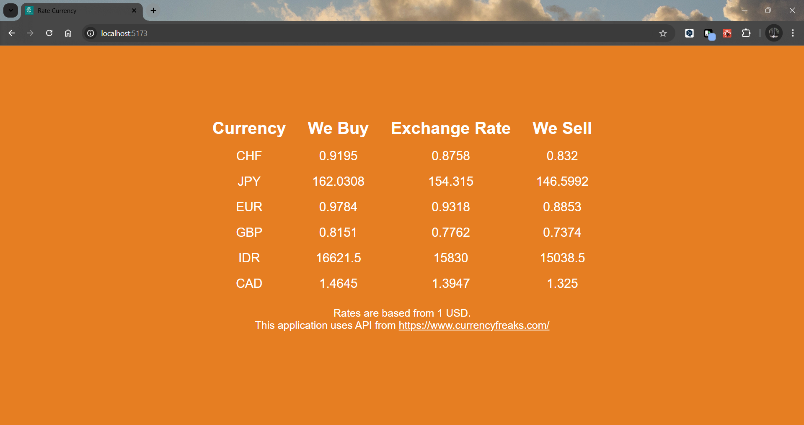

# Assignment Project: Display Rate Currency
## Churun Ain Azkal Azkiya (RCJ04S018)

Aplikasi ini menggunakan 3rd party API dari CurrencyFreaks untuk menampilkan nilai tukar mata uang berdasarkan 1 USD untuk beberapa mata uang internasional. Aplikasi ini menghitung nilai tukar berdasarkan data yang diterima dari API dan menampilkan tiga kolom utama: Exchange Rate, We Buy, dan We Sell.

### Tampilan Awal
