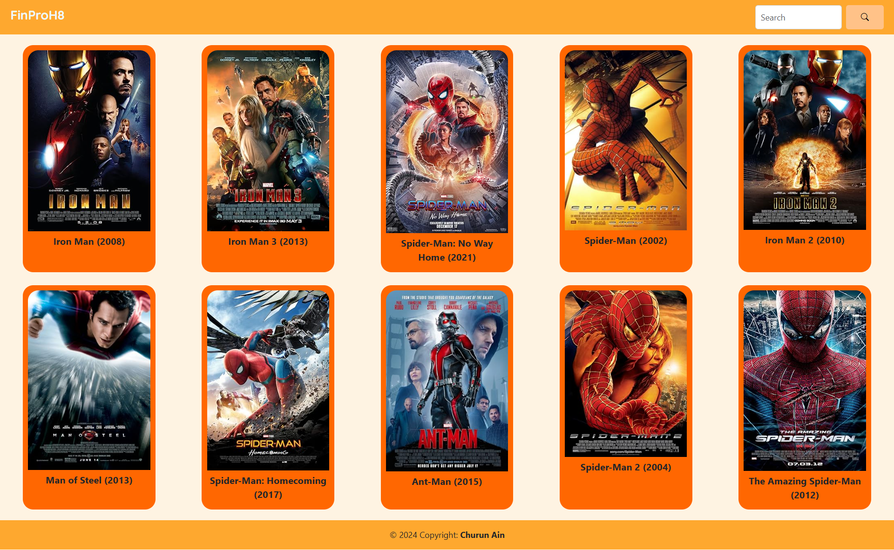

# Assignment 6 - Project Requirements: A Simple Movies List App
## Churun Ain Azkal Azkiya (RCJ04S018)

*Movie app* ini adalah aplikasi berbasis web yang memungkinkan pengguna mencari informasi film secara mudah dan cepat menggunakan OMDB API. Dibangun dengan React JS dan Axios untuk fetch API. Aplikasi ini menyediakan fitur pencarian film berdasarkan judul yang diinginkan, di mana pengguna dapat mengetik judul film lalu menekan tombol *search* untuk melihat hasilnya yang menampilkan poster, judul, dan tahun rilis film tersebut.

### Tampilan
